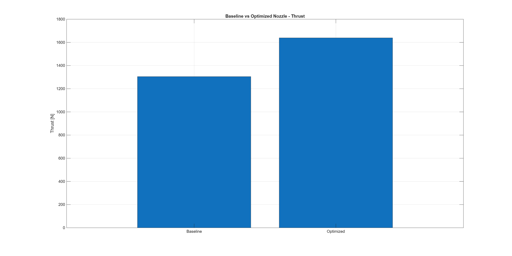
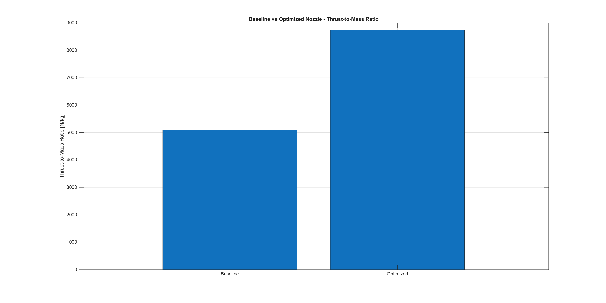
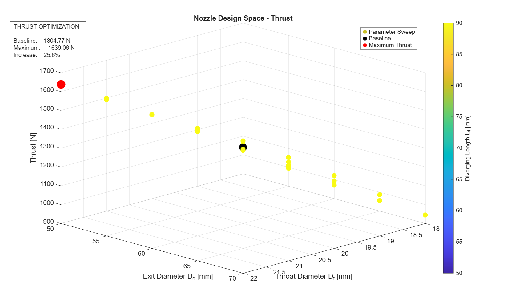

# Rocket Nozzle Design Optimization

A SolidWorks and MATLAB project exploring how nozzle geometry affects modeled thrust and thrust-to-nozzle-mass ratio using a simplified analytical nozzle model.

## Project Goal

Design a baseline nozzle in SolidWorks, evaluate its performance in MATLAB, and use classical optimization to identify a geometry with improved modeled performance.

## Tools

- **SolidWorks** — nozzle CAD and final geometry
- **MATLAB** — analytical modeling, parameter sweep, optimization, and visualization

## Workflow

1. Created a baseline nozzle in SolidWorks.
2. Developed a simplified 1-D isentropic nozzle model in MATLAB.
3. Evaluated 125 geometry combinations, with 98 satisfying the design constraints.
4. Used `fmincon` to optimize thrust and thrust-to-nozzle-mass ratio.
5. Created the optimized geometry in SolidWorks.
6. Compared the baseline and optimized designs.

## Baseline vs. Optimized

| Metric | Baseline | Optimized | Change |
|---|---:|---:|---:|
| Throat diameter | 20 mm | 22 mm | — |
| Exit diameter | 60 mm | 50 mm | — |
| Diverging length | 70 mm | 50 mm | — |
| Modeled thrust | 1304.77 N | 1639.06 N | +25.62% |
| Nozzle mass | 0.2564 kg | 0.1877 kg | -26.76% |
| Thrust-to-mass | 5089.72 N/kg | 8730.42 N/kg | +71.53% |
| Mass flow | 0.5923 kg/s | 0.7167 kg/s | +21.00% |
| Exit velocity | 2480.19 m/s | 2313.94 m/s | -6.70% |

## Results

### Thrust Comparison



### Thrust-to-Mass Comparison



### Design Space



## Model

The MATLAB model uses a simplified 1-D, steady-flow, isentropic approach with assumed operating conditions and an efficiency factor.

The optimization varies:

- Throat diameter: 18–22 mm
- Exit diameter: 50–70 mm
- Diverging length: 50–90 mm

Geometric constraints are applied to ensure physically reasonable nozzle dimensions.

## Limitations

This project is intended for **educational design exploration**, not physical engine performance prediction.

The model:

- Uses simplified 1-D flow assumptions
- Assumes constant gas properties
- Uses an assumed efficiency factor
- Uses a simplified nozzle mass model
- Has not been experimentally validated

## Repository Structure

```text
rocket-nozzle-optimization/
│
├── MATLAB/
│   ├── functions/
│   ├── baseline_test.m
│   ├── optimized_design_test.m
│   ├── parameter_sweep.m
│   ├── classical_optimization.m
│   ├── plot_design_space_3D.m
│   ├── compare_designs.m
│   ├── save_comparison_data.m
│   └── plot_baseline_vs_optimized.m
│
├── SolidWorks/
│   ├── CAD/
│   └── Drawings/
│
├── Results/
│   ├── Figures/
│   └── Data/
│
└── Documentation/
    ├── Equations_and_Assumptions.md
    └── Final_Report.md
